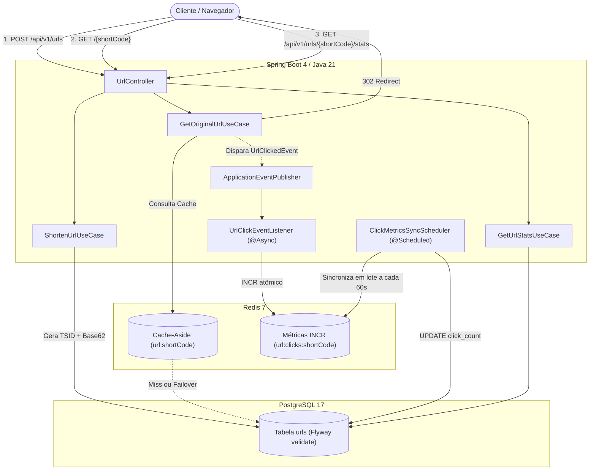

# Arquitetura e Fluxo de Dados

Visão aprofundada dos componentes de software, ciclo de vida das requisições e interação entre banco relacional, cache distribuído e mensageria em memória.

---

## 🏗️ Diagrama de Componentes e Fluxo

---

## 🔍 Detalhamento dos Fluxos

### 1. Fluxo de Criação de URL (`POST /api/v1/urls`)
1. A requisição chega com a URL original e passa por validações de bean validation (`@NotBlank`, `@Size`, `@URL`).
2. O `ShortenUrlUseCase` gera um TSID de 64 bits pré-persistência e calcula o código Base62 correspondente em memória.
3. A entidade `UrlEntity` é persistida diretamente via `persist()` (otimizado via interface `Persistable` do Spring Data).
4. Em caso de corrida concorrente de URLs idênticas, a constraint única é acionada (`DataIntegrityViolationException`) e tratada com fallback idempotente para retornar o registro existente.

### 2. Fluxo de Redirecionamento (`GET /{shortCode}`)
1. O `GetOriginalUrlUseCase` consulta primeiro a chave no Redis (`Cache-Aside`).
2. **Hit:** Se a URL existir no cache, o redirecionamento HTTP 302 é montado imediatamente.
3. **Miss ou Falha de Conexão com Redis:** A aplicação busca no PostgreSQL e aquece o cache (com tratamento *fail-safe* caso o Redis esteja indisponível).
4. Um evento `UrlClickedEvent` é emitido de forma desacoplada via `ApplicationEventPublisher`.

### 3. Telemetria e Sincronização em Lote
1. O listener `UrlClickEventListener` processa o evento de clique de forma assíncrona (`@Async`), efetuando um `INCR` atômico na chave de métricas do Redis.
2. A rota principal de redirecionamento é liberada para o cliente sem esperar tempo de I/O em disco.
3. O `ClickMetricsSyncScheduler` roda periodicamente (`@Scheduled`), lê os contadores consolidados no Redis e faz a atualização em lote no PostgreSQL, preservando os recursos do banco relacional.
